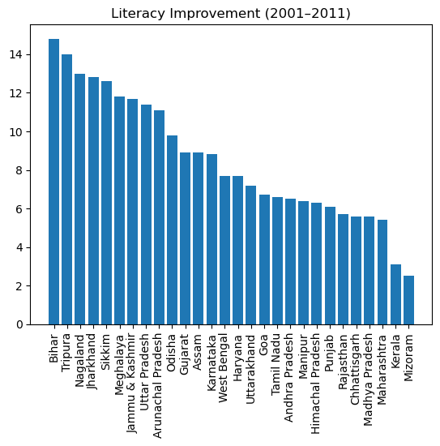
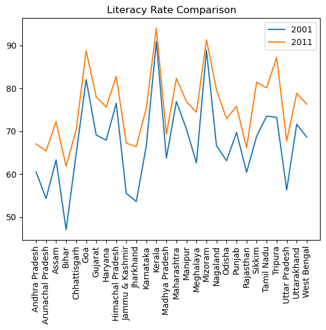
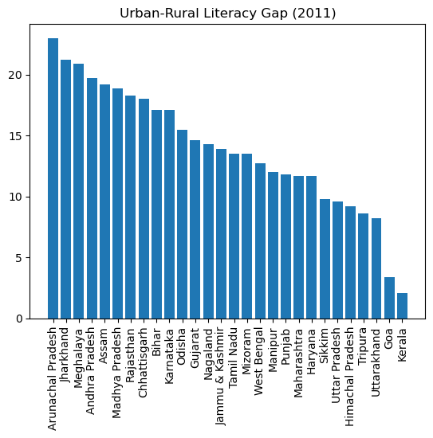

# 📊 Literacy Data Analysis (India)

## 📌 Overview
This project analyzes literacy trends across Indian states between 2001 and 2011 using Python. The focus is on understanding improvements in literacy rates, identifying regional disparities, and examining rural-urban gaps.

---

## 🎯 Objective
To evaluate changes in literacy rates and derive insights that can support data-driven decision-making and monitoring of education programs.

---

## 🛠️ Tools & Technologies
- Python
- Pandas
- Matplotlib
- Data Cleaning & Visualization

---

## 📊 Key Analysis Performed
- State-wise literacy comparison (2001 vs 2011)
- Improvement in literacy rates over time
- Rural vs Urban literacy gap analysis

---

## 📊 Sample Visualizations

### 📈 Literacy Improvement (2001–2011)

### 📊 Literacy Comparison (2001 vs 2011)

### 🌆 Rural vs Urban Literacy Gap

---

## 📈 Key Insights
- Literacy rates improved across most states between 2001 and 2011
- Significant variation exists in performance across states
- Urban literacy rates are consistently higher than rural literacy rates
- Rural-urban disparities highlight unequal access to education

---

## 🧠 Conclusion
The analysis shows that while India has made progress in improving literacy rates, regional and rural-urban disparities still exist. This highlights the need for targeted interventions and continuous monitoring.

---

## 💡 Relevance
This project demonstrates how data can be used for monitoring and evaluation (M&E) of education programs and supports evidence-based decision making.

---

## 📁 Project Files
- Dataset (CSV)
- Jupyter Notebook / Python Script
- Visualizations

---

## 🚀 Future Improvements
- Include more recent data
- Add gender-based analysis
- Use advanced visualization tools
